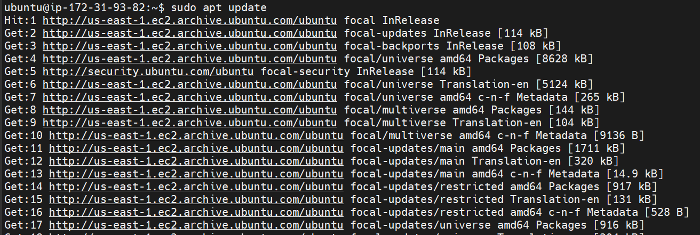
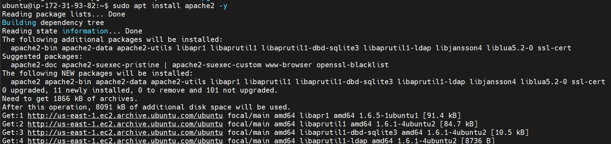
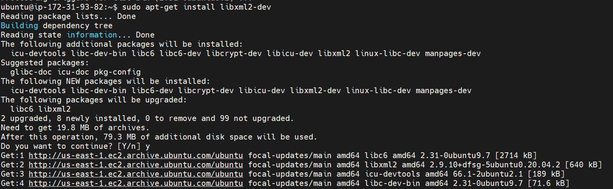
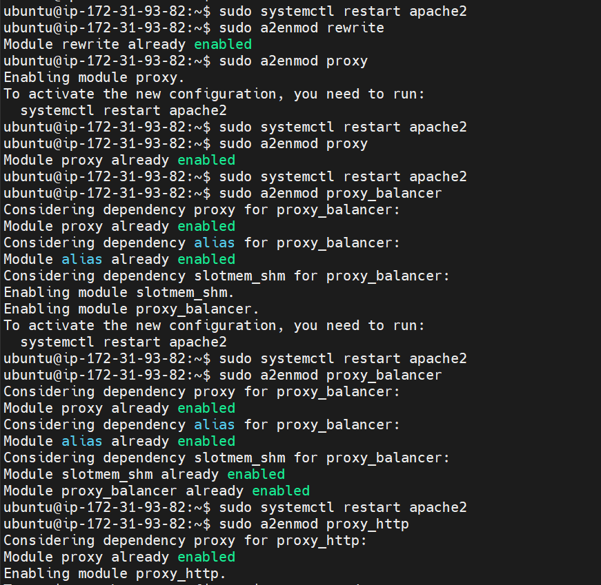
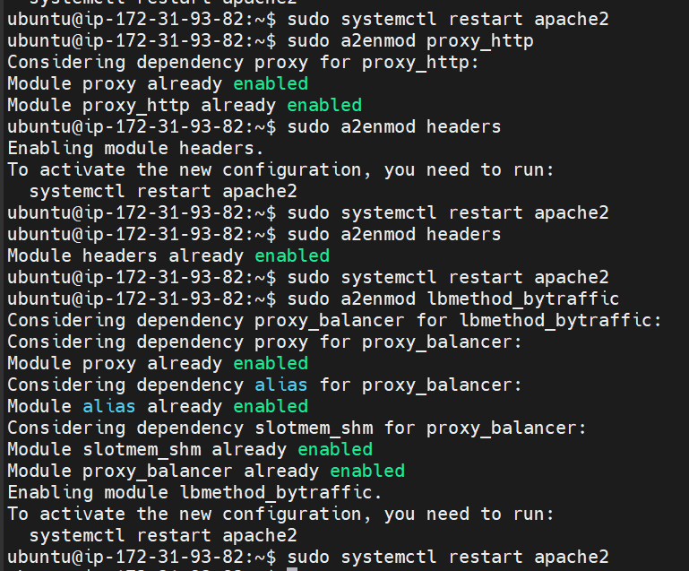
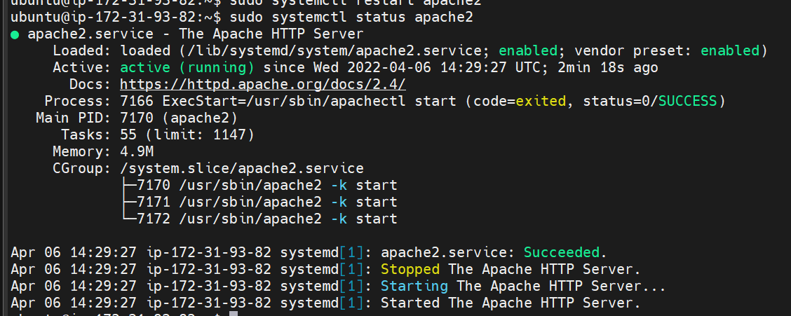
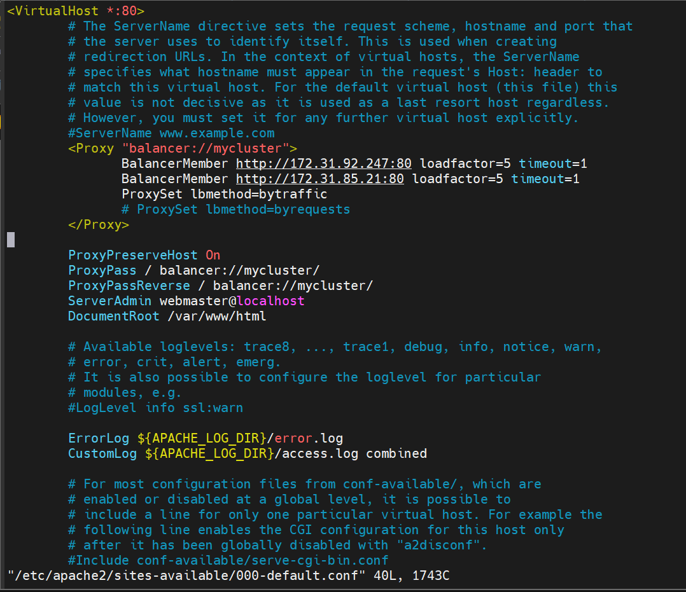
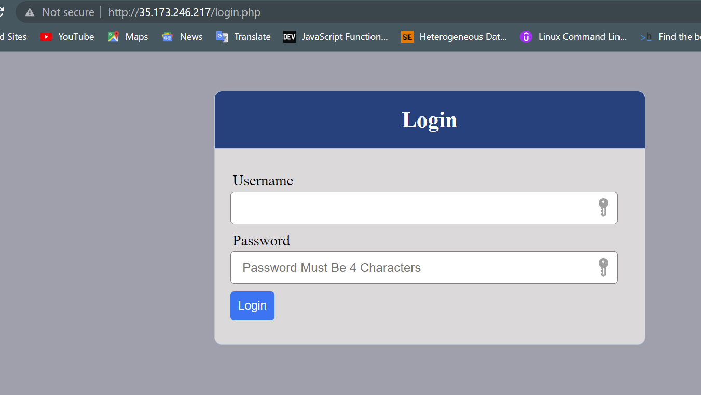
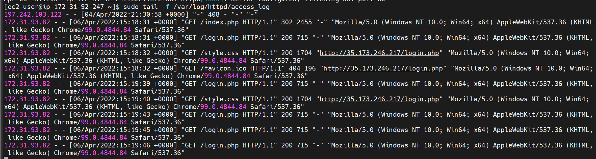
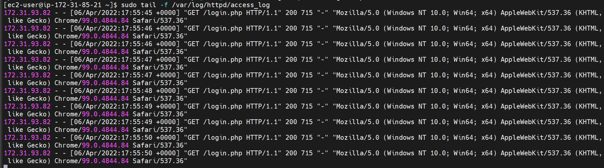

# CONFIGURE APACHE AS A LOAD BALANCER

Create an ubuntu ec2 instance with tcp port 80 open

Update Ubuntu 

`sudo apt update`

Install Apache

`sudo apt install apache2 -y`

`sudo apt-get install libxml2-dev`

Enable modules

`sudo a2enmod rewrite`

`sudo a2enmod proxy`

`sudo a2enmod proxy_balancer`

`sudo a2enmod proxy_http`

`sudo a2enmod headers`

`sudo a2enmod lbmethod_bytraffic`

Restart Apache

Check apache's status

Configure load-balancing

`sudo vi /etc/apache2/sitees-available/000-default.conf`

Add below configurations

Restart Apache server

`sudo systemctl restart apache2`

Verify that our configuration works 

Check logs of load-balancer access on webservers 

`sudo tail -f /var/log/httpd/access_log`

